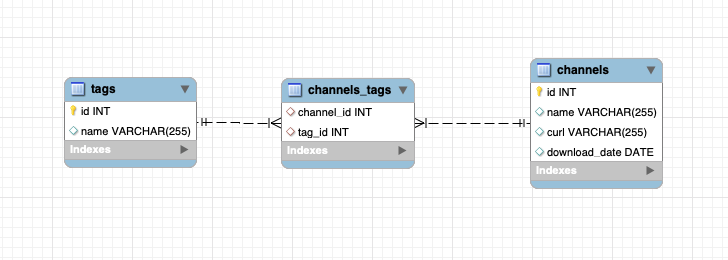
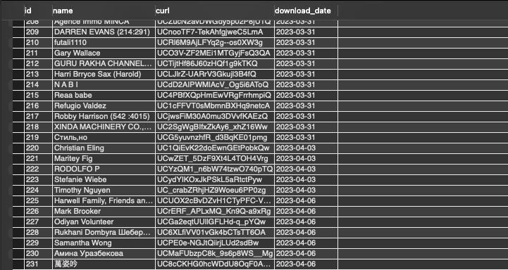
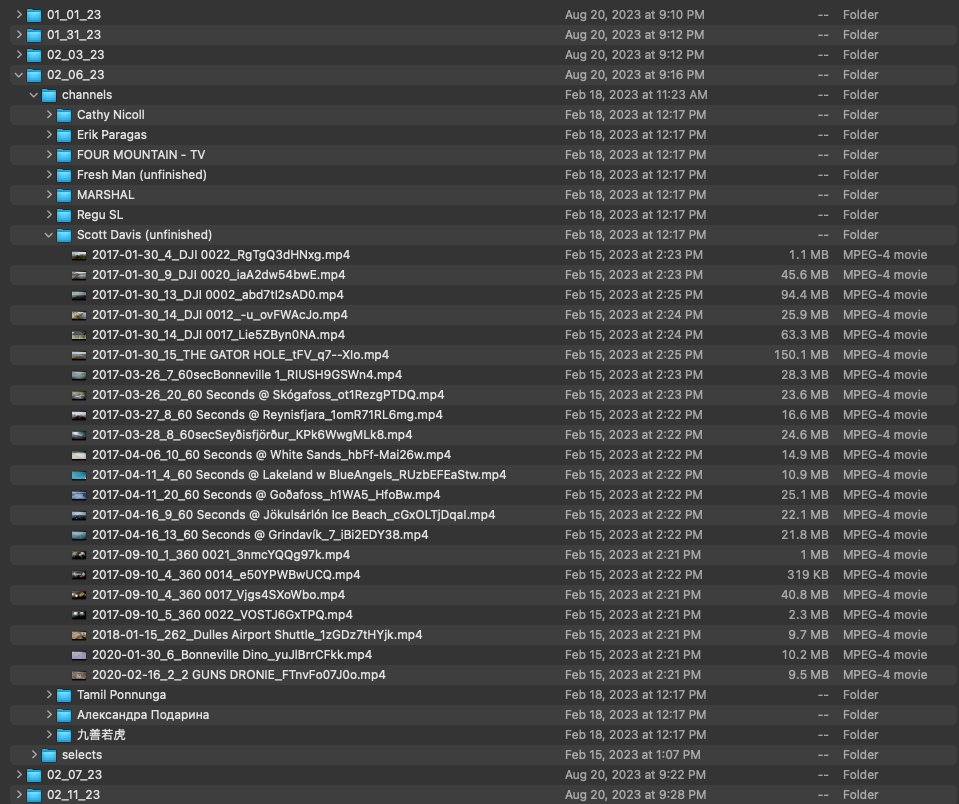

# SQL Video Archive Database

## About

This relational database is used to tag and catalog an archival folder structure of video files. The database has three folders, channels, tags, and channels_tags. The 'channels' table contains one entry per folder of videos in the folder structure. The 'tags' table contains a list of relevant tag keywords, and the channels tag is an association table consisting of foreign keys referencing the ID from both the 'channels' and 'tags' tables. This database represents a many-to-many relationship.

## Tech Stack

 

